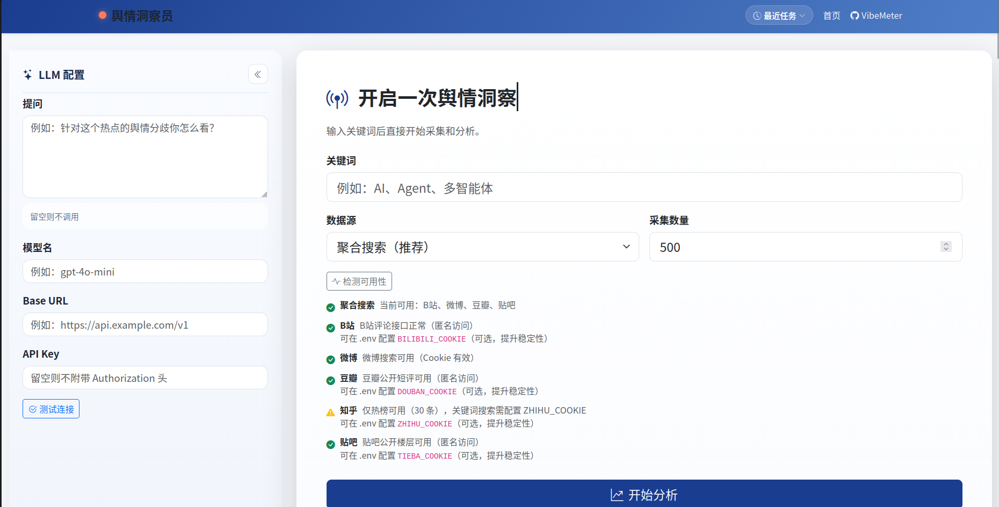
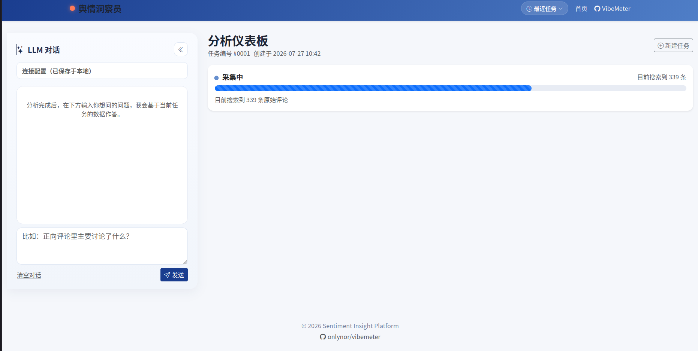
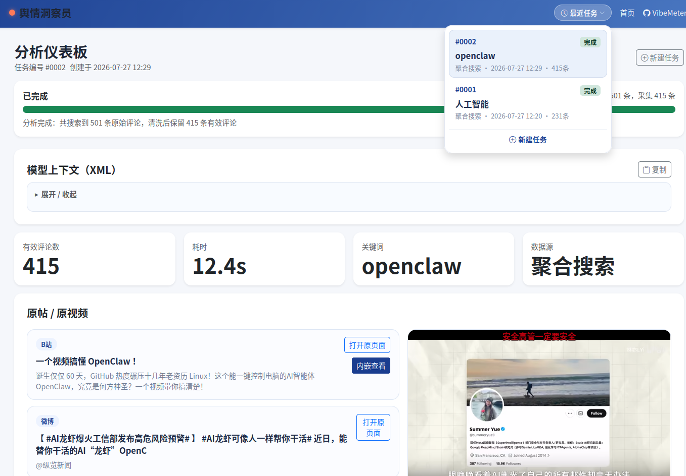
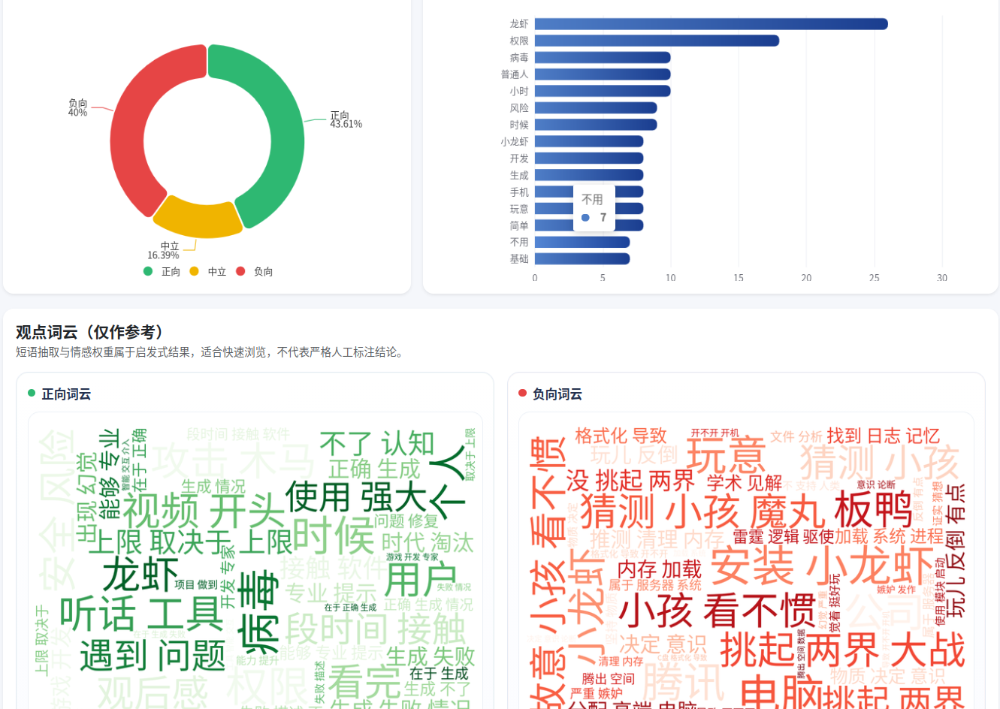
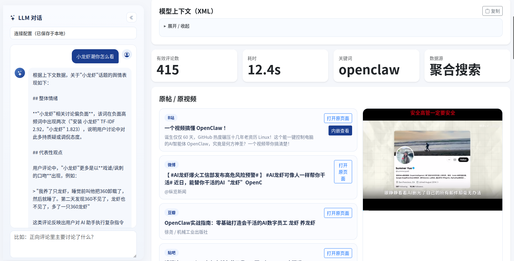

# VibeMeter · 舆情洞察员

[](https://github.com/onlynor/vibemeter)

> 输入关键词，从 **B 站 / 微博 / 豆瓣 / 知乎 / 贴吧** 抓取公开评论，做清洗、分词与 `SnowNLP` 情感打分，在仪表板里看情感分布、观点词云和代表性评论；可选挂 LLM 做对话式解读。
>
> FastAPI + React/Vite，前后端分离。



---

## 快速开始

**1. 配 Cookie（可选）**

```bash
cp .env.example .env     # 生效的是 .env，填在 .env.example 里没用
```

全留空也能跑：豆瓣、贴吧、B 站匿名可用；微博和知乎必须配 Cookie。

**2. 起服务**（两个终端）

```bash
# 后端 → http://127.0.0.1:8092
cd backend && uv run python run.py

# 前端 → http://127.0.0.1:5173
cd frontend && pnpm install && pnpm dev
```

打开 <http://127.0.0.1:5173> 即可。

**Docker 一键**

```bash
docker compose up --build     # 前端 :8080，后端 :8092
```

---

## 数据源

跑之前点首页的「检测可用性」，能直接看出谁在风控，不用等几分钟才发现。

| 数据源 | 匿名可用 | Cookie | 备注 |
|---|:---:|---|---|
| 豆瓣 | ✅ | 可选 | 移动端接口读公开短评（影视 + 图书） |
| 贴吧 | ✅ | 可选 | 移动端接口搜主题 + 读楼层 |
| B 站 | ⚠️ | 建议配 | 评论接口 `-412` 风控常态化，配 Cookie 可绕过 |
| 微博 | ❌ | **必需** | 公开搜索强制登录态，需含 `SUB` 字段 |
| 知乎 | ❌ | **必需** | 匿名搜索恒 400；没 Cookie 只能退回热榜匹配，量很小 |

> **复制 Cookie 务必取完整值**：开发者工具里过长的值会用省略号 `…` 截断显示，直接复制会得到一个无法作为请求头发送的坏值。请在控制台执行 `document.cookie`，或右键 → Copy value。

---

## 功能

### 采集

`auto` 模式五源并发，单源首批 8 s 未返回自动跳过。进度经 WebSocket 实时推送。



### 分析结果

`jieba` 分词 + 词性过滤（名词/动词/形容词）+ 停用词，`SnowNLP` 打分：> 0.6 记正向、< 0.4 记负向。展示情感分布、Top 15 高频词、最正/最负各 3 条代表评论，以及各平台原帖（B 站视频可内嵌播放）。



### 观点词云

正负向短语按差减值排序，自动剔除两边都高频的争议词。



### LLM 解读（可选）

侧边栏基于本次任务的结构化数据对话，SSE 流式输出、随时可中止。API Key 只存在服务端进程内存里，关进程即清空，不写文件、不写 localStorage。



### 导出

原始 / 清洗后 / 带情感标注 / 摘要四份 JSON，点下载时现场从 SQLite 生成，服务端不留中间文件。

---

## 项目结构

```text
backend/    FastAPI + SQLite，uv 管理；app/crawlers 下每个平台一个爬虫
frontend/   React + Vite + TypeScript，pnpm 管理
.env        数据源 Cookie（仅进程内使用，不落盘）
```

后端只提供 API + WebSocket，不 serve 前端；SPA 路由由前端处理。完整接口文档见 <http://127.0.0.1:8092/docs>。

> 每次后端启动会重置任务历史，运行期只保留最近 10 个任务。

---

## 技术栈

FastAPI · Uvicorn · SQLite (aiosqlite) · httpx · BeautifulSoup · jieba · SnowNLP · wordcloud

React 18 · Vite 5 · TypeScript 5 · ECharts 5 · marked · DOMPurify

LLM 侧兼容任意 OpenAI 格式 endpoint（自带 Base URL + Key）。

---

## License

[MIT License](LICENSE)
